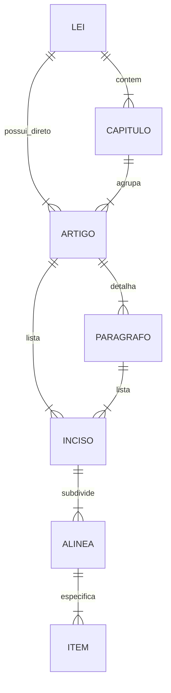

# Documentação Técnica - API de Importação e Processamento de Leis

## 1. Visão Geral
A **API de Importação de Leis** é uma solução robusta desenvolvida para automatizar a captura, processamento e estruturação de textos legais. O sistema permite a ingestão de dados através de duas vias principais: **Web Scraping** de fontes oficiais (Planalto, Câmara, Senado) e **Upload de Arquivos** (.doc/.docx). O diferencial central é a capacidade de interpretar o texto bruto e estruturá-lo hierarquicamente (Artigos, Parágrafos, Incisos, etc.), facilitando a indexação e consulta.

## 2. Arquitetura e Tecnologias

### Stack Tecnológico
- **Runtime**: Node.js 18+
- **Linguagem**: TypeScript (Tipagem estática para maior segurança e manutenibilidade)
- **Framework Web**: Express.js
- **Banco de Dados**: PostgreSQL (Produção) / SQLite (Dev)
- **ORM**: Prisma (Gerenciamento de schema e migrações)
- **Validação**: Zod (Schema validation para inputs)
- **Documentação**: Swagger/OpenAPI

### Motores de Processamento
- **Scraping**: 
  - *Playwright*: Para renderização de páginas dinâmicas e interações complexas.
  - *Cheerio*: Para parsing de HTML estático e extração rápida de dados.
- **Processamento de Documentos**:
  - *Mammoth*: Conversão de arquivos .docx para HTML/Texto preservando semântica.
- **Testes**:
  - *Jest*: Suíte completa para testes unitários e de integração.

## 3. Funcionalidades Principais

### 3.1. Ingestão de Dados
- **Scraping On-Demand**: Endpoint para captura em tempo real a partir de URLs oficiais.
- **Upload de Arquivos**: Suporte a arquivos Word (.doc, .docx) com validação de MIME types e sanitização.
- **Processamento em Lote**: Capacidade de processar múltiplas URLs ou arquivos em uma única requisição.

### 3.2. Processamento Inteligente
- **Parser Léxico**: Algoritmo proprietário para identificar e estruturar hierarquia legal:
  - Lei -> Artigos -> Parágrafos -> Incisos -> Alíneas -> Itens.
- **Normalização**: Padronização de formatação, remoção de ruídos e caracteres especiais.

### 3.3. Gestão e Segurança
- **Autenticação**: Sistema baseado em JWT (JSON Web Tokens) com cookies `httpOnly`.
- **Controle de Acesso (RBAC)**: Níveis de permissão para `admin` e `funcionario`.
- **Rate Limiting**: Proteção contra abuso e sobrecarga nos endpoints de scraping e upload.

## 4. Estrutura de Dados (Data Model)

O modelo de dados é relacional e hierárquico, refletindo a estrutura canônica das leis brasileiras.

## 5. Endpoints da API

### Autenticação
- `POST /api/auth/login`: Autenticação de usuários.
- `GET /api/auth/me`: Validação de sessão.

### Leis
- `GET /api/leis`: Listagem com filtros (busca textual, origem, paginação).
- `GET /api/leis/:id`: Detalhes completos de uma lei estruturada.
- `POST /api/leis`: Criação manual de leis.
- `PUT /api/leis/:id`: Atualização completa.
- `DELETE /api/leis/:id`: Remoção de registros.

### Scraping & Upload
- `POST /api/scrap`: Aciona o motor de scraping para uma URL.
- `POST /api/upload`: Recebe arquivo .docx para processamento.

### Administração
- `GET /api/users`: Gestão de usuários (apenas Admin).
- `GET /api/leis/stats`: Estatísticas de uso e volume de dados.

## 6. Requisitos de Infraestrutura
- **Servidor de Aplicação**: Instância Node.js com mínimo de 1GB RAM (recomendado 2GB para scraping concorrente).
- **Banco de Dados**: PostgreSQL 14+.
- **Dependências de Sistema**: Bibliotecas para suporte ao Playwright (browsers).

## 7. Segurança e Conformidade
- Sanitização de inputs para prevenção de SQL Injection e XSS.
- Senhas armazenadas com hash forte (Bcrypt).
- Logs de auditoria para operações críticas.
